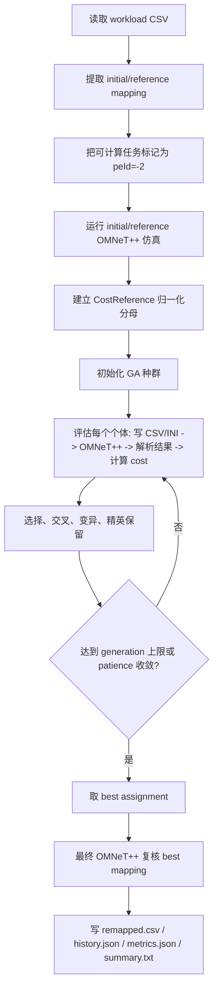

# 任务重映射如何使用 GA 算法

本文档说明 `D:\HNOCS` 当前 B-2 任务重映射实验中，遗传算法（Genetic Algorithm, GA）具体如何参与优化。这里讲的是仓库里的实际实现，而不是泛泛的 GA 模板。核心代码主要位于：

- `D:\HNOCS\experiment\B-2\run.py`
- `D:\HNOCS\experiment\B-2\ga_mapper.py`
- `D:\HNOCS\experiment\mapping\omnet_evaluator.py`
- `D:\HNOCS\experiment\mapping\omnet_cost_model.py`
- `D:\HNOCS\experiment\mapping\task_graph.py`
- `D:\HNOCS\experiment\mapping\csv_writer.py`

## 1. 一句话概括

本实验把“每个可重映射任务应该放到哪个 PE 上执行”编码成 GA 的染色体。GA 反复生成候选映射，每个候选映射都被写成临时任务 CSV，并由 OMNeT++ 全系统仿真评估。仿真输出中的温度、makespan、DVFS、能耗等指标，再加上解析任务图得到的通信和拥塞代理项，被合成为 initial/reference mapping 归一化的多目标代价。GA 的目标就是最小化这个复合代价。

因此，当前 B-2 不是只靠简单热代理函数排序的 mapper，而是一个 simulation-in-the-loop 的任务到 PE 映射搜索器。

## 2. 任务重映射问题的建模方式

### 2.1 输入任务图

输入来自 `examples\task_driven\static\*.csv`，例如 GEMM、MPEG4、VOPD、HNN 的静态任务图。CSV 每一行描述一个任务：

```text
taskId, peId, compTime_ns, outSize_B, succId:succPE, ...
```

在 `TaskGraph` 中，`peId` 的含义是：

| `peId` | 含义 | 是否由 GA 优化 |
|---:|---|---|
| `-1` | GB injection task / 全局缓冲相关任务 | 否，保持不变 |
| `-2` | dynamic task / 需要分配到 PE 的任务 | 是 |
| `>= 0` | 已有静态 PE 分配 | 通常用于提取 initial/reference mapping |

`run.py` 会先读取原始静态 CSV，并从其中提取 initial/reference mapping：

```python
baseline_asgn = _extract_baseline(graph)
```

随后会把非 GB 且已有 PE 的任务改成 `peId=-2`：

```python
_make_mappable(graph)
```

这一步的含义是：保留原始映射作为归一化参照，同时让这些任务重新变成 GA 可以搜索的位置变量。

### 2.2 搜索空间

当前 `SimParams` 默认是 `4 x 4` mesh，因此一共有 16 个 PE，编号为 `0..15`。如果一个 workload 有 `N` 个可映射任务，则一个候选解需要给这 `N` 个任务各自指定一个 PE。

搜索空间大小近似为：

```text
16^N
```

这也是使用 GA 的原因：穷举所有 task-to-PE assignment 在任务数稍大时不可行，而 GA 可以用种群搜索在有限仿真预算内寻找较优映射。

## 3. GA 染色体如何表示任务映射

在 `ga_mapper.py` 中，一个个体由 `GAIndividual` 表示：

```python
@dataclass
class GAIndividual:
    chromosome: list[int]
    fitness: float = float("inf")
    omnet_info: dict | None = None
```

染色体是一个 PE 编号列表：

```text
chromosome = [pe_for_task_0, pe_for_task_1, ..., pe_for_task_N_minus_1]
```

这里的第 `i` 个基因对应 `graph.mappable_task_ids[i]` 这个任务。`mappable_task_ids` 按任务图拓扑序排列，所以染色体顺序是稳定的。

个体转换为仿真可用映射时使用：

```python
def to_assignment(self, mappable_ids):
    return dict(zip(mappable_ids, self.chromosome))
```

例如，假设可映射任务拓扑序是：

```text
mappable_task_ids = [3, 4, 7, 9]
```

某个染色体是：

```text
chromosome = [2, 5, 5, 12]
```

则对应的任务映射是：

```text
task 3 -> PE 2
task 4 -> PE 5
task 7 -> PE 5
task 9 -> PE 12
```

这个完整 mapping 会被写成静态 CSV，交给 OMNeT++ 运行。

## 4. 总体流程

当前 B-2 主流程由 `run.py::run_benchmark()` 驱动：



关键点有三个：

1. initial/reference mapping 会先单独仿真一次，用于建立归一化参考。
2. GA 中每个候选映射都通过 OMNeT++ 评估，不只是用静态公式估计。
3. GA 找到的 best mapping 最后会再跑一次 OMNeT++，并检查最终 cost 是否和 GA 记录的 best fitness 一致。

## 5. 初始种群如何生成

`GAMapper._initialize_population()` 负责生成第一代种群。

如果调用时传入 `seed_assignment`，第一个个体会直接使用这个映射。当前 `run_benchmark()` 默认没有传入 `seed_assignment`，所以第一代通常从随机染色体开始。

随后填满整个种群。每个新个体有两种来源：

1. 直接随机生成：

```python
[randrange(num_pes) for _ in range(num_tasks)]
```

2. 从已有个体中复制一个 base chromosome，然后以 `0.2` 的概率逐基因扰动，形成变体。

这种初始化让种群既有随机覆盖，也有围绕已有候选的局部扰动。注意这里的 `0.2` 是初始化变体时的扰动概率，不是正式 GA mutation rate；正式 mutation rate 默认是 `0.1`。

## 6. 适应度如何评估

### 6.1 每个个体都跑一次 OMNeT++

个体适应度评估由 `GAMapper._evaluate_population()` 和顶层函数 `evaluate_fitness()` 完成。对于每个尚未评估的个体：

1. 将 chromosome 转成 `{taskId: peId}` assignment。
2. 调用 `OmnetEvaluator.evaluate(graph, assignment)`。
3. `OmnetEvaluator` 创建唯一临时目录。
4. `write_static_csv()` 写出这个 assignment 对应的任务 CSV。
5. 生成临时 `omnetpp_ga_<id>.ini`，继承基础配置 `ONoCGeneral`。
6. 调用 `libhnocs.exe -u Cmdenv ...` 运行 OMNeT++。
7. 解析 `.sca`、`.vec`，必要时使用 `thermal_snapshot.json` 作为温度回退来源。
8. 把解析到的指标封装为 `OmnetScalars`。
9. 调用 `OmnetCostModel.total_cost()` 得到 fitness。

如果 OMNeT++ 运行失败，或者关键结果缺失，该个体 fitness 会被设为：

```python
float("inf")
```

这意味着它在最小化问题中会自然被淘汰。

### 6.2 OMNeT++ 输出提供哪些指标

`OmnetScalars` 汇总了一次仿真的关键输出。主要来源包括：

| 来源 | 解析指标 | 用途 |
|---|---|---|
| `.sca` | `makespan_s`、PE energy、SOA energy、MRR tuning energy、laser energy、DVFS penalty ratio | 性能、能耗、DVFS |
| `.vec` | 每个 PE 的 `pe-die-temperature` 时间序列 | 峰值温度、温度标准差、热点 PE 数 |
| `thermal_snapshot.json` | PE/router final temperatures | 当 `.vec` 不完整时作为温度回退 |
| 任务图和 assignment | Manhattan hop 通信代价、XY path edge congestion、load imbalance | 通信、拥塞、负载均衡 |

一个仿真结果只有满足以下条件，才会被视为可用于 cost：

```text
run_ok == true
temperature_complete == true
pe_peak_temp_K > 0
makespan_s > 0
pe_optical_comm_energy_J > 0
```

这也是为什么不能只看 summary 文本；判断结果有效性应优先看 `metrics.json` 中的 `run_status` 和结构化字段。

## 7. CostReference 与 initial/reference 归一化

本实验中的 `baseline` 字段主要是代码里的历史命名，在论文叙事中应理解为 initial mapping、reference mapping 或 normalization reference，而不是外部 baseline method。

流程上，`run.py` 先对 initial/reference mapping 运行一次 OMNeT++：

```python
bl_scalars = evaluator.evaluate(graph, baseline_asgn)
cost_reference = cm_omnet.make_reference(baseline_asgn, bl_scalars)
```

`make_reference()` 会保存各项归一化分母：

| 分母 | 含义 |
|---|---|
| `peak_excess_K` | initial/reference 的 PE 峰值温度超过 ambient 的部分 |
| `sigma_T_K` | initial/reference 的时间平均空间温度标准差 |
| `N_hot` | initial/reference 中超过 throttling 阈值的 PE 数 |
| `makespan_s` | initial/reference makespan |
| `pe_optical_comm_energy_J` | initial/reference 的 PE + optical communication energy |
| `eta_dvfs_pct` | initial/reference 的平均 DVFS penalty |
| `comm_cost` | initial/reference 的 analytical hops * dataSize |
| `congestion_cost` | initial/reference 的静态 edge congestion |
| `load_imbalance` | initial/reference 的计算负载不均衡 |

之后 GA 中每个候选映射的对应指标都会除以这些 reference 值。例如：

```text
f_makespan = current_makespan / reference_makespan
f_energy   = current_energy   / reference_energy
f_comm     = current_comm     / reference_comm
```

这样做有两个重要作用：

1. 不同量纲的指标可以放进一个加权和中比较。
2. 代价的解释相对清楚：小于 1 表示该项优于 initial/reference，大于 1 表示该项变差。

## 8. GA 优化的复合目标

当前 fitness 名称在 `metrics.json` 里是：

```text
baseline_normalized_v2
```

论文写作中更适合称为：

```text
initial-mapping-normalized composite cost
```

`OmnetCostModel.total_cost()` 的形式为：

```text
J =
  w_T          * f_thermal
+ w_sigma      * f_sigma
+ w_hot        * f_hot
+ w_makespan   * f_makespan
+ w_H          * f_comm
+ w_congestion * f_congestion
+ w_D          * f_dvfs
+ w_L          * f_load
+ w_E          * f_energy
```

各项含义如下：

| 项 | 代码字段 | 含义 | 越小表示 |
|---|---|---|---|
| 峰值温度 | `f_thermal` | 当前 PE peak excess 相对 reference peak excess | 峰值温升更低 |
| 温度不均匀性 | `f_sigma` | 当前 `sigma_T` 相对 reference `sigma_T` | 温度分布更均匀 |
| 热点数量 | `f_hot` | 当前热点 PE 数相对 reference 热点 PE 数 | 超过阈值的 PE 更少 |
| Makespan | `f_makespan` | 当前 makespan 相对 reference makespan | 执行完成更快 |
| 通信距离 | `f_comm` | `sum(hops * dataSize)` 相对 reference | 任务间通信距离更短 |
| 拥塞代理 | `f_congestion` | XY path 上最大 physical-edge load 相对 reference | 静态通信热点更少 |
| DVFS 惩罚 | `f_dvfs` | 当前平均 throttle penalty 相对 reference | 热节流影响更小 |
| 负载不均衡 | `f_load` | PE compute load variance 相对 reference | 计算负载更均衡 |
| 能耗 | `f_energy` | PE + SOA + tuning + laser energy 相对 reference | 总通信/光层相关能耗更低 |

当前默认权重由 `GAConfig` 和 CLI 参数给出：

| 权重 | 默认值 | 作用 |
|---|---:|---|
| `w_T` | `1.0` | 峰值温度 |
| `w_sigma` | `1.0` | 温度标准差 |
| `w_hot` | `0.6` | 热点 PE 数 |
| `w_makespan` | `1.2` | makespan，当前权重略高 |
| `w_H` | `0.4` | 通信距离 |
| `w_congestion` | `0.7` | 静态拥塞 |
| `w_D` | `0.4` | DVFS penalty |
| `w_L` | `0.2` | 负载均衡 |
| `w_E` | `0.5` | PE + optical communication energy |
| `w_peak` | `0.0` | 额外峰值超阈惩罚；默认关闭 |

如果 reference 的所有归一化项都等于 1，并且某些项非零，则 initial/reference 的 composite cost 大体等于相关权重之和。以常见配置为例，权重和为：

```text
1.0 + 1.0 + 0.6 + 1.2 + 0.4 + 0.7 + 0.4 + 0.2 + 0.5 = 6.0
```

所以 GEMM、MPEG4、HNN 的 initial/reference cost 常见为 `6.0`。如果某个 reference 项本身为 0，例如没有热点或没有 DVFS，则对应归一化项可能不会以完整权重贡献，VOPD 等 workload 的 reference cost 可能不是 6.0。

## 9. 选择、交叉、变异和精英保留

GA 主循环在 `GAMapper.run()` 中：

```text
for gen in 1..num_generations:
    evaluate population
    record best/avg/worst
    update global best
    if patience reached: stop
    create next generation
```

### 9.1 选择：tournament selection

父代选择使用锦标赛选择：

```python
candidates = random.sample(population, tournament_size)
return min(candidates, key=lambda ind: ind.fitness)
```

默认 `tournament_size=3`。这表示每次随机抽 3 个个体，选择 fitness 最小的作为父代。它不是全局只选最优个体，而是在保留选择压力的同时维持一定多样性。

### 9.2 交叉：uniform crossover

交叉使用 uniform crossover。对两个父代的每个基因位置，子代以 50% 概率继承父代 1 的 PE，以 50% 概率继承父代 2 的 PE：

```text
parent1: [2, 5, 1, 8]
parent2: [7, 5, 9, 3]
child:   [2, 5, 9, 8]  # 每个位置独立选择
```

默认 `crossover_rate=0.8`。如果本次没有交叉，则直接复制两个父代中 fitness 更好的那个。

### 9.3 变异：per-task PE mutation

子代生成后会执行逐基因变异：

```python
if random() < mutation_rate:
    chromosome[i] = randrange(num_pes)
```

默认 `mutation_rate=0.1`。因此每个任务的位置都有 10% 概率被重新随机分配到 `0..15` 中的某个 PE。

变异的作用是跳出已有父代组合的限制，探索新的 PE 分配。由于任务图映射空间很大，变异是避免种群过早收敛的重要机制。

### 9.4 精英保留：elitism

每一代开始构造下一代时，会先把当前 fitness 最好的若干个体直接复制过去：

```python
elite_count = 2
```

这保证当前找到的好映射不会因为交叉或变异而丢失。对仿真成本很高的 GA 来说，精英保留尤其重要，因为每一个高质量个体都来自真实 OMNeT++ 评估。

### 9.5 早停：patience

如果连续若干代没有刷新全局 best fitness，就提前停止：

```text
patience = 10
```

注意：`converged=false` 只表示没有触发 patience 早停，或者一直跑到 generation 上限；它不等价于结果无效。结果是否有效应看最终 `metrics.json` 中的 `run_status`、`valid_for_cost` 相关字段和 `best_fitness` 是否有限。

## 10. 并行评估

GA 中最耗时的是每个个体的 OMNeT++ 仿真。`GAConfig.n_workers` 控制并行评估数量。

当 `n_workers <= 1` 时，当前进程顺序评估种群。

当 `n_workers > 1` 时，代码使用：

```python
ProcessPoolExecutor(max_workers=n_workers)
```

每个 worker 负责运行候选映射的 OMNeT++ 仿真并返回 fitness。由于 Windows 的 `ProcessPoolExecutor` 使用 spawn 模式，worker 会重新导入模块，所以 `run.py` 在启动前会把 OMNeT++ 路径参数写入 `ga_mapper` 的模块级变量，并且评估函数也显式传递路径参数，避免子进程找不到 `libhnocs.exe`、NED 路径或 `opp_scavetool`。

## 11. 代码默认参数与当前结果中的实际参数

代码默认值来自 CLI 和 `GAConfig`：

| 参数 | 默认值 | 含义 |
|---|---:|---|
| `population_size` / `--population` | `50` | 每代个体数 |
| `num_generations` / `--generations` | `30` | 默认最多迭代代数 |
| `elite_count` / `--elite` | `2` | 每代直接保留的最优个体数 |
| `tournament_size` / `--tournament` | `3` | 锦标赛选择候选数 |
| `crossover_rate` | `0.8` | 进行交叉的概率 |
| `mutation_rate` | `0.1` | 每个任务 PE 分配发生变异的概率 |
| `patience` | `10` | 早停等待代数 |
| `workers` | `1` | 默认单进程；长实验通常显式提高 |

需要特别区分：代码默认 `num_generations=30`，但当前仓库可见的 `out\experimental results\B-2-v4` 主实验样例使用的是：

| 项 | 实际值 |
|---|---:|
| seeds | `40..49` |
| generations | `60` |
| population | `50` |
| crossover rate | `0.8` |
| mutation rate | `0.1` |
| fitness | `baseline_normalized_v2` |

例如当前可见结果 `out\experimental results\B-2-v4\seed_40\gen_60\gemm\metrics.json` 中，GEMM 的 initial/reference composite cost 为 `6.0`，GA best/final B-2 composite cost 为约 `3.7756`。写论文或汇报时，应优先以具体 `metrics.json` 中的 `config` 字段为准，而不是只引用代码默认值。

## 12. 输出文件如何对应 GA 过程

每个 workload 的输出目录通常包含：

| 文件 | 内容 |
|---|---|
| `remapped.csv` | GA 找到的 best assignment，已写成静态 task-to-PE CSV |
| `history.json` | 每一代的 `best_fitness`、`avg_fitness`、`worst_fitness`、最高温度和 best 信息 |
| `metrics.json` | initial/reference 与 B-2 best mapping 的结构化指标、cost terms、配置和运行状态 |
| `summary.txt` | 面向快速查看的文本摘要，不应作为核心解析来源 |

`metrics.json` 是最重要的结果文件，原因是它同时保存：

1. initial/reference 的仿真指标。
2. GA best mapping 的最终复核仿真指标。
3. `cost_terms` 中每个归一化项的贡献。
4. `config` 中实际运行的 GA 参数、权重和 `cost_reference`。
5. `run_status` 中的解析完整性和有效性信息。

如果要解释 GA 为什么选择了某个 remapping，优先查看：

```text
metrics.json -> b2 -> tradeoff -> cost_terms
history.json -> 每代 best_fitness 的变化
remapped.csv -> 最终 task-to-PE placement
```

## 13. 与论文叙事的关系

这个 GA 任务重映射方法的论文表达建议是：

```text
我们将任务到 PE 的映射视为系统级热管理控制变量。GA 在离散映射空间中搜索候选 task-to-PE assignment；每个候选映射均由包含 WDM 光层、MRR 热调谐、SOA/laser 能耗、紧凑 RC 热网络和 DVFS 反馈的 OMNeT++ 全系统模型评估。候选映射的适应度定义为 initial-mapping-normalized composite cost，联合考虑热稳定性、性能、通信、拥塞、DVFS、负载均衡和能耗。最终输出的是相对 initial/reference mapping 具有更低复合代价的静态重映射。
```

注意几个表述边界：

1. 不要把代码中的 `baseline` 直接写成外部 baseline method；它在 B-2 主流程中主要是 initial/reference mapping。
2. 不要说 GA 单纯优化温度。它优化的是多目标复合代价。
3. 不要说所有 workload 的所有指标都同步改善。VOPD 和 HNN 需要按多目标折中来解释。
4. 不要把 `RandomBest` 当成普通随机平均 baseline。它更适合作为 best-of-random sanity/control。
5. 不要仅从 `summary.txt` 手工抄结果；论文表格和图应从 `metrics.json` 或聚合 CSV/JSON 中提取。

## 14. 用伪代码串起来

下面的伪代码概括了当前实现：

```text
for workload_csv in selected_workloads:
    graph = TaskGraph.from_csv(workload_csv)

    reference_assignment = extract_static_pe_assignment(graph)
    mark_original_tasks_as_mappable(graph)

    reference_scalars = run_omnet(graph, reference_assignment)
    reference = make_reference(reference_assignment, reference_scalars)

    population = initialize_population(population_size)
    best = None
    stagnant = 0

    for generation in 1..num_generations:
        for individual in population:
            if individual.fitness is not evaluated:
                assignment = chromosome_to_assignment(individual.chromosome)
                scalars = run_omnet(graph, assignment)

                if scalars are invalid:
                    individual.fitness = infinity
                else:
                    individual.fitness = normalized_composite_cost(
                        assignment,
                        scalars,
                        reference,
                        weights
                    )

        generation_best = min(population by fitness)
        record_history(generation_best, average, worst)

        if generation_best improves global best:
            best = generation_best
            stagnant = 0
        else:
            stagnant += 1

        if stagnant >= patience:
            break

        population = elites
                   + offspring_by_tournament_selection_uniform_crossover_mutation

    final_scalars = run_omnet(graph, best.assignment)
    assert final_cost == best.fitness

    write remapped.csv
    write history.json
    write metrics.json
    write summary.txt
```

## 15. 可以如何检查一次 GA 结果

如果要人工核查某个 workload 的 GA 是否可信，可以按这个顺序：

1. 打开 `metrics.json`，确认 `baseline.run_status` 和 `b2.run_status` 都是有效仿真。
2. 看 `config.cost_reference`，确认归一化分母来自同一次 initial/reference mapping。
3. 看 `b2.tradeoff.cost_terms.total_cost` 是否等于 `b2.tradeoff.TR2_composite_cost`。
4. 看 `b2_best_fitness` 是否与最终复核的 `TR2_composite_cost` 一致。
5. 看 `history.json` 中 `best_fitness` 是否有限，并观察它是否随 generation 下降。
6. 打开 `remapped.csv`，确认所有非 GB 任务都被分配到合法 PE 编号。
7. 对论文使用时，再从聚合 CSV/JSON 中做 seed-aware 统计，不只取单次结果。

## 16. 小结

当前 B-2 的 GA 用法可以归纳为：

- 染色体：完整 task-to-PE mapping。
- 基因：一个可重映射任务的 PE 编号，范围 `0..15`。
- 个体：一个完整候选映射。
- 种群：同一 workload 下的一组候选映射。
- 适应度：OMNeT++ 仿真输出和静态图分析共同构成的 initial/reference 归一化复合代价。
- 优化方向：最小化 composite cost。
- 进化操作：锦标赛选择、uniform crossover、逐基因 mutation、elite preservation。
- 收敛控制：generation 上限加 patience 早停。
- 最终产物：`remapped.csv` 中的静态重映射，以及 `metrics.json` 中可追溯的多目标指标。

这套方法的关键创新点不是“使用 GA”本身，而是把 GA 的候选映射评估绑定到 ONoC 全系统仿真，使每次搜索决策同时感知热、性能、通信、拥塞、DVFS 和光层能耗之间的耦合关系。
